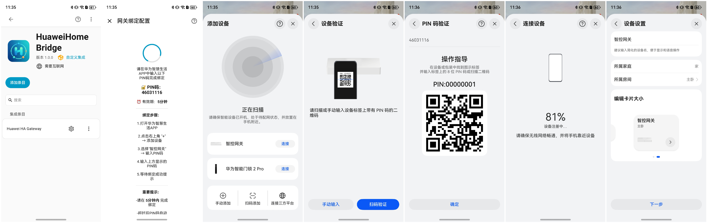

# hwhomebridge

> **⚠️ WARNING**
> 
> 本项目非Home Assistant官方集成，仅实测了部分厂家设备，处于持续迭代中，存在适配兼容与稳定性风险，**请勿直接用于生产环境**。

> ### 免责声明
> 
> - **非官方项目**：本项目为个人开发者维护的社区项目，与华为技术有限公司无任何关联，未经华为官方授权、认可或赞助。
> - **商标声明**："华为"、"HiLink"、"鸿蒙"、"HarmonyOS"、"华为智慧生活"、"小艺"等名称及标识均为华为技术有限公司的商标。本项目仅出于功能描述目的引用，不主张任何权利。
> - **SDK 使用**：本项目使用了部分HiLink SDK功能，该 SDK 的使用可能受华为相关服务条款约束。使用者需自行了解并承担相关合规风险。
> - **账号风险**：使用本桥接方案接入华为云服务，可能导致华为账号受限、封禁或其他不可预见后果，使用者需自行承担风险。
> - **无担保**：本项目按"现状"提供（AS IS），不提供任何明示或暗示的担保。作者不对因使用本项目而产生的任何直接或间接损失负责，包括但不限于设备损坏、数据丢失、账号封禁、服务中断等。
> - **合规责任**：使用者有责任确保在本地区的法律法规框架下合法使用本项目。
## 简介

**hwhomebridge** 是一个 **[Home Assistant](https://www.home-assistant.io/)** 自定义集成，具有以下功能：

- 将接入 HA 平台的设备接入到华为鸿蒙智家
- 接入华为生态后，可通过 **华为智慧生活 APP** 或 **小艺** 控制设备
- 支持远程控制、语音控制、智能场景联动

## 集成优势

- **统一控制：** 在华为智慧生活界面集中控制所有已接入 HA 的设备
- **远程控制：** 通过华为云服务，实现设备远程控制能力
- **语音控制：** 支持华为小艺控制设备
- **智能联动：** 利用华为智慧生活平台能力，轻松搭建自动化场景

## 品类支持范围

目前支持以下品类：

1. 💡 床头灯(001) / 灯泡(002) / 小夜灯(003)
2. 🌡️ 压力传感器(004)
3. 🫖 电水壶(005)
4. 🦟 灭蚊器(006)
5. 🍚 电饭煲(007)
6. 🔌 断路器(008)

## 环境要求

- Home Assistant Core ≥ 2023.1
- 华为智慧生活 APP（最新版本）
- 运行平台：Linux (aarch64 / amd64)

> 插件支持 `aarch64(arm64)` 和 `amd64(x86_64)` 两种架构，对应 SO 库分别位于 `hilink_bridge/lib/aarch64/` 和 `hilink_bridge/lib/amd64/` 目录下，集成启动时按需加载。
>
> aarch64 适配树莓派 64 位、arm64 版 Home Assistant 官方容器；amd64 适配 x86_64 服务器及虚拟化环境。
>
> 若使用 Alpine（musl libc）轻量 Docker 镜像，需要额外安装 glibc 兼容层 `gcompat`；推荐使用 Debian/Ubuntu 基础镜像（原生 glibc），避免 so 库加载异常。

## 集成安装

### 方式1：HACS

1. 在 HACS 中添加自定义仓库：

```
https://github.com/Wangxiaokang666-666/ha_hwhomebridge
```

2. 点击下载并安装
3. 重启 Home Assistant

### 方式2：手动安装

1. 下载本仓库到 `config/custom_components/` 目录下
2. 重启 Home Assistant


## 集成配置

### 步骤1：安装集成

1. 进入 Home Assistant 后台
2. ⚙️ 设置 > 设备与服务 > 添加集成
3. 搜索 `hwhomebridge`
4. 点击安装，按照提示完成配置


### 步骤2：绑定设备

1. 安装完成后，点击 **配置** 按钮
2. 页面将显示一个 **8位 PIN 码**
3. 打开 **华为智慧生活 APP**
4. 点击右上角 "+" > 添加设备
5. 选择 "HA 网关" > 输入 PIN 码
6. 等待绑定成功



### 步骤3：添加设备

绑定成功后，集成将自动发现并同步 HA 中的设备到华为智慧生活。

## 设备控制链路

```
华为智慧生活 APP / 小艺语音
        ↓
    华为云服务
        ↓
       SDK 
        ↓
  hwhomebridge
        ↓
  Home Assistant
        ↓
   实际设备
```

## 开发者相关

### 三层配置架构

配置采用三层分离设计，将固定的华为定义与多变的厂家适配解耦：

```
config/
├── product_registry.json              # 框架层：华为产品定义
├── adapters/
│   ├── default/                        # 默认适配器：HA 标准映射
│   │   ├── 001.json  002.json  ...     # 灯、传感器、电水壶等标准映射
│   ├── xiaomi/                         # 小米适配器：match_rules + 差异覆盖
│   │   ├── cooker.json  bulb.json  ...
│   └── midea/                          # 美的适配器
│       └── cooker.json
```


| 层级                                      | 内容                                                | 修改时机        |
| ----------------------------------------- | --------------------------------------------------- | --------------- |
| **框架层** `product_registry.json`        | PID + service_type + char_name + auto_match         | 品类拓展时修改  |
| **默认适配器** `adapters/default/*.json`  | 标准 HA 映射（domain、action、value_mapping、范围） | 基本不变        |
| **厂家适配器** `adapters/<vendor>/*.json` | match_rules + 与华为标准的差异覆盖                  | 随厂家/型号变化 |

**三层合并规则**：`框架(service_type/char_name) + 默认(ha_mapping) + 厂家(差异覆盖) = 最终定义`

### 设备匹配流程

设备发现时，按以下优先级依次匹配：

```
1. 厂家适配器 match_rules（按规则类型优先级）：
   model_exact → model_keyword → name_keyword → entity_composition
   匹配成功 → 合并(框架 + 默认 + 厂家) → 返回

2. 框架 auto_match（标准品类零配置接入）：
   required_domains ⊆ 设备 domains + 可选 name_keywords
   匹配成功 → 合并(框架 + 默认) → 返回

3. 都不匹配 → 跳过设备
```

**标准品类**（灯、压力传感器、断路器）配了 `auto_match`，新厂家设备无需写适配器即可自动接入。**复杂品类**（电饭煲、电水壶、灭蚊器）必须通过厂家适配器匹配。

### 项目结构

```
hwhomebridge/
├── __init__.py              # 集成入口
├── config_flow.py           # 配置流程
├── hwbridge.py              # 核心桥接逻辑（C 库初始化、回调注册、状态监听）
├── service_router.py        # 控制路由（on_command）、状态上报、设备注册
├── virtual_device.py        # 虚拟设备模型（聚合单元 + SN 管理）
├── product_registry.py      # 三层配置加载（框架 + 默认 + 厂家）、合并逻辑
├── product_matcher.py       # 三级匹配引擎（match_rules → auto_match → skip）
├── service_action.py        # 服务操作分发（控制命令执行）
├── pin_manager.py           # PIN 码管理
├── const.py                 # 常量定义
├── validate_config.py       # 配置验证工具
├── config/
│   ├── product_registry.json          # 框架层配置
│   └── adapters/                      # 适配器目录
│       ├── default/                   # 默认适配器
│       ├── xiaomi/                    # 小米适配器
│       └── midea/                     # 美的适配器
└── translations/            # 国际化翻译
```

### 设备映射（设备识别）

设备映射决定了 HA 设备如何被识别为华为生态中的某个产品。

**匹配规则类型**（按优先级）：

**1. model_exact 精确匹配**

```json
{"type": "model_exact", "model": "chunmi.cooker.c301"}
```

**2. model_keyword 关键词匹配**

匹配设备 model 中包含的关键词，适用于同产品线多型号：

```json
{"type": "model_keyword", "keywords": ["MB-FB"]}
```

**3. name_keyword 关键词匹配**

匹配设备名称包含的关键词（不区分大小写）：

```json
{"type": "name_keyword", "keywords": ["电水壶", "热水壶", "kettle"]}
```

**4. entity_composition 组合匹配**

根据设备包含的实体类型组合匹配：

```json
{"type": "entity_composition", "required_domains": ["switch", "sensor"]}
```

**调整技巧**：若您的设备未被自动识别，可在 HA 中修改设备名称添加关键词，或在厂家适配器的 `match_rules` 中添加规则。

### 实体映射（服务能力）

实体映射定义了华为产品的每个服务如何对应到 HA 实体。

**关键字段**：


| 字段                     | 说明                                 | 示例                                                                    |
| ------------------------ | ------------------------------------ | ----------------------------------------------------------------------- |
| `domain`                 | HA 实体域                            | `light`、`switch`、`sensor`、`select`、`button`                         |
| `action`                 | 操作类型                             | `turn_on_off`、`set_brightness`、`set_value`、`set_option`、`read_only` |
| `value_attr`             | 状态属性                             | `state`、`brightness`                                                   |
| `name_keywords`          | 实体名称关键词（多实体设备精确匹配） | `["工作状态"]`                                                          |
| `brightness_range`       | 亮度范围上限                         | `100`                                                                   |
| `colorTemperature_range` | 色温范围上限 (Kelvin)                | `6500`                                                                  |
| `colorTemperature_min`   | 色温范围下限 (Kelvin)                | `2700`                                                                  |
| `stop_option`            | select 域关机时选择的选项            | `"停止"`                                                                |
| `on_command`             | switch.on=1 时的声明式控制覆盖       | `{"type": "trigger_service", ...}`                                      |
| `default_mode`           | 默认模式（trigger_service 使用）     | `"1"`                                                                   |

**声明式控制（on_command）**：

复杂设备（如电饭煲）的开关行为通过 `on_command` 声明，而非硬编码：

```json
"on_command": {
    "type": "trigger_service",
    "service": "cooker",
    "use_default_mode": true
}
```

当华为下发 `switch.on=1` 时，自动触发 cooker 服务使用 default_mode 启动烹饪，无需设备专用代码。

### 值映射（数据转换）

值映射解决华为 HiLink 协议与 HA 实体状态之间的数值转换问题。

**支持类型**：


| 类型                   | 用途                         | 示例                                    |
| ---------------------- | ---------------------------- | --------------------------------------- |
| `enum_to_number`       | 华为枚举 → HA 数值          | 电水壶模式：华为枚举"7" → HA 温度 80℃ |
| `text_to_enum`         | HA 文本 → 华为枚举          | 工作状态："加热中" → 枚举值 2          |
| `enum_to_text_multi`   | 华为枚举 → HA 多个可选文本  | 电饭煲模式映射（支持多厂商中英文）      |
| `number_to_enum_multi` | HA 数值 → 华为枚举          | 状态码 0-5 的文本映射                   |
| `seconds_to_minutes`   | 时间单位转换                 | 秒 → 分钟（除以 60）                   |
| `delay_to_select`      | 华为倒计时 → HA select 选项 | 灭蚊器定时：3/8/12 小时 → select 选项  |

**示例 - 电水壶模式映射**：

```json
{
    "domain": "number",
    "action": "set_value",
    "value_mapping": {
        "type": "enum_to_number",
        "mapping": {"7": 80, "5": 85, "4": 90}
    }
}
```

**示例 - 电饭煲状态映射（多厂商适配）**：

不同厂商的状态文本可能不同，通过 `enum_to_text_multi` 支持多值匹配：

```json
{
    "type": "enum_to_text_multi",
    "mapping": {
        "1": ["快煮饭", "Quick Cook", "quick"],
        "2": ["精煮饭", "Fine Cook", "煮饭"]
    }
}
```

控制时从 HA select 的 options 中找到匹配项；上报时反向查找枚举值。

### 新增设备适配指南

#### 场景 1：新厂家的标准品类（如 Tuya 灯）

**零配置** — 如果设备有 `light` 域实体，`auto_match` 会自动匹配到灯泡 PID，使用默认 HA 映射。无需创建任何文件。

如果需要精确匹配或有色温范围差异，创建厂家适配器：

```json
// config/adapters/tuya/bulb.json
{
    "pid": "002",
    "match_rules": [
        {"type": "model_keyword", "keywords": ["tuya.light"]}
    ],
    "services": {
        "cct": {"colorTemperature_min": 2700}
    }
}
```

只写差异字段，其余从默认适配器继承。

#### 场景 2：新厂家的复杂品类（如美的电饭煲）

创建厂家适配器，写完整 service 覆盖：

```json
// config/adapters/midea/cooker.json
{
    "pid": "007",
    "match_rules": [
        {"type": "model_keyword", "keywords": ["MB-FB"]}
    ],
    "services": {
        "switch": {
            "domain": "select",
            "action": "turn_on_off",
            "stop_option": "停止",
            "on_command": {"type": "trigger_service", "service": "cooker", "use_default_mode": true}
        },
        "cooker": {
            "value_mapping": {"type": "enum_to_text_multi", "mapping": {"1": ["精华饭"], ...}}
        }
    }
}
```

#### 场景 3：同厂家新型号

在已有适配器的 `match_rules` 中添加 model 即可，无需新建文件：

```json
"match_rules": [
    {"type": "model_exact", "model": "chunmi.cooker.c301"},
    {"type": "model_exact", "model": "chunmi.cooker.c301s"},
    {"type": "name_keyword", "keywords": ["电饭煲"]}
]
```

### 何时需要改 Python 实现


| 场景                 | 需要改代码？                              |
| -------------------- | ----------------------------------------- |
| 新厂家，已有品类     | 否 — 厂家适配器 JSON                     |
| 新型号，同厂家同品类 | 否 — 加 match_rules                      |
| 新的值映射类型       | 是 —`ValueMapping` 类                    |
| 新的 HA domain       | 是 —`_report_by_type` + `service_action` |
| 新的 on_command 类型 | 是 —`_execute_on_command`                |
| 新华为品类（新 PID） | 是 — 框架 JSON + C 侧 SDK 编译           |

### 配置验证

修改配置后，运行验证工具检查一致性：

```bash
python validate_config.py
```

验证内容：PID 引用有效性、action+domain 兼容性、match_rules 有效性。

### 快速排障

**设备未被识别**：

1. HA 中查看设备型号：设置 → 设备与服务 → 选择集成 → 点击设备 → 查看"型号"
2. 方案 A：修改设备名称添加关键词
3. 方案 B：在厂家适配器的 `match_rules` 中添加 `model_keyword` 规则

**控制失败或状态不正确**：

1. HA 开发者工具中查看实体状态：开发者工具 → 状态 → 搜索实体
2. 检查实体名称、状态值是否符合 `ha_mapping` 和 `value_mapping` 定义
3. 调整 `name_keywords` 或 `value_mapping.mapping`

**色温设置不生效**：

设备实际支持的色温范围可能与华为默认（2000-6500K）不同。在厂家适配器中指定范围：

```json
"services": {
    "cct": {
        "colorTemperature_min": 2700,
        "colorTemperature_range": 6500
    }
}
```

超出范围的值会自动裁剪到边界值。

## 注意事项

- PIN 码有效期为 **5分钟**，超时需重新获取
- 集成删除后，如需重新添加，请先重启 Home Assistant，否则集成将无法重新正常工作
- 华为 PID 和 C 侧代码暂时无法动态扩展

## 许可证

Apache 2.0 License

## 贡献

欢迎提交 Issue 和 Pull Request！

新增厂家适配器时，请按 `config/adapters/<vendor>/<category>.json` 的目录结构组织，并运行 `python validate_config.py` 验证配置正确性。

